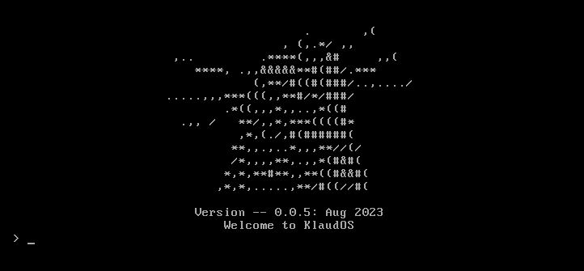

<h1 align="center">
  <br>
  <br>
  KlaudOS
  <br>
</h1>

<h4 align="center">The first Klaud themed Operating System</h4>

<p align="center">
  <a href="#features">Features</a> •
  <a href="#how-to-use">How To Use</a> •
  <a href="#build-from-source">Build From Source</a> •
  <a href="#download-from-release">Download from Release</a> •
  <a href="#credits">Credits</a> •
  <a href="#license">License</a>
</p>

<p align="center">
  
</p>

## Features

* Double Stage Bootloader
* 32 bit protected mode + gdt
* FAT12 file system
* Interrupt handler
* FPU support
* Responsive Kernel with commands 
    * visit docs/commands.md to see all possible commands
    * visit demo.mp4
* Built in x86 assembly and C
* Fits on a floppy

## How To Use

### Build from Source

Make sure you have the following software installed before proceeding:
* gcc
* make
* nasm
* qemu-system-x86

```bash
# Clone this repository
$ git clone https://github.com/coldmayo/KlaudOS

# Go into the repository
$ cd KlaudOS

# install gcc and binutils
$ make config
$ make toolchain

# make make.sh, run.sh, and clean.sh executable files
$ chmod +x make.sh
$ chmod +x clean.sh
$ chmod +x run.sh

# cook up a disk image
$ ./make.sh

# Open OS in qemu
$ ./run.sh
```

### Download From Release

You can download the latest version of KlaudOS <a href="https://github.com/coldmayo/KlaudOS/releases">here</a>.

## Contact Me

If you liked KlaudOS, it would be cool if you emailed me at <coldmayo@proton.me> and told me anything you want me to know.

## Credits

This software would not be possible without the following people/tools:

- [OSDev Forum](https://www.osdev.org/)
- [Nanobyte](https://www.youtube.com/@nanobyte-dev)
- [JamesM's kernel development tutorials](https://web.archive.org/web/20160412174753/http://www.jamesmolloy.co.uk/tutorial_html/index.html)
- [The little book about OS development](https://littleosbook.github.io/)

## License

MIT

---