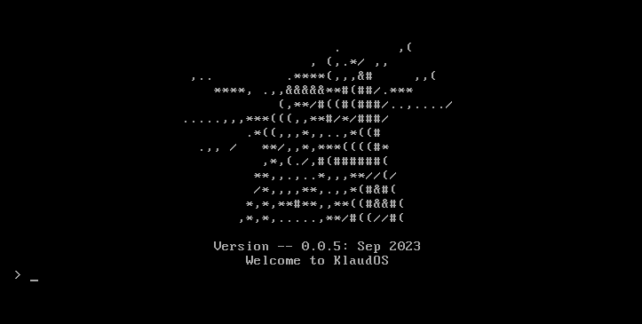
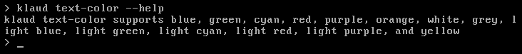
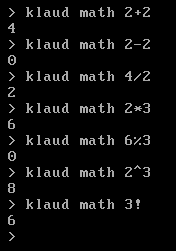
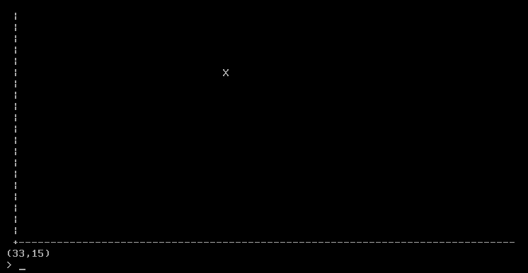
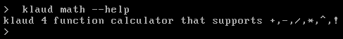
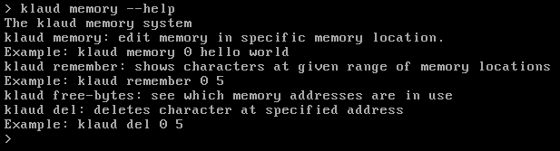

<h1 align="center">
   
   
    Commands
   
</h1>

  <a href="#general">General</a> •
  <a href="#ascii-pictures">Ascii Pictures</a> •
  <a href="#math">Math</a> •
  <a href="#memory">Memory</a> •
  <a href="#sillygames">Silly/Games</a>

## General

### klaud
Every command starts with klaud

### klaud --help
General help. Shows all available commands.

### klaud echo
Works the same as echo command in Linux

### klaud clear

Clears screen. That's it.

input command: klaud clear

### klaud restart

Restarts the kernel after entering yes into the prompt.

### klaud startup

Without restarting the kernel takes the user back to the title page.

input command:
klaud startup

### klaud text-color
Command to change the text color. You can check klaud text-color --help to see which colors are supported.

input command:
klaud text-color purple

### klaud back-color
Command to change the background color. You can check klaud back-color --help to see which colors are supported.

input command:

klaud back-color light blue

### klaud text-color random
Klaud chooses what color your text is from the available colors listed in klaud text-color --help.

input command:

klaud text-color random

### klaud text-color default
Change text-color back to default (white). You could use klaud text-color white to do this but in my head this command is easier to use.

input commands:

klaud text-color default

### klaud text-color --help
Help function for klaud text-color.

### klaud back-color --help
Help function for klaud back-color.

## Ascii Pictures

### klaud ascii
Prints ascii picture of klaud

### klaud shrine
Prints ascii picture of klaud with flowers, great for meditation

### klaud live-slug-reaction
Prints ascii picture of klaud actually reacting

## Math

### klaud math
Simple calculator with PEMDAS. Supports: 
* Addition
* Subtraction
* Multiplication
* Division
* Modulo
* Exponential
* Factorials

### klaud plot
A text-based plotting system. Used for plotting simple functions like y = x or y = x^2

input command: klaud plot x

### klaud plot point
Plots a point at a specified location. To add more points to plot run the command again. The point just plotted will be in the form of a 'X' while the previous points are in the form of a 'O'. To clear the plot run the klaud plot clear command.

There is also a line of best fit calculation below the plot (it's not great but it is what it is).

input commands (in this order): 

klaud plot point 0,0

klaud plot point 2,2

### klaud plot point random
Plots a point in a random place on the grid. This command operates the same as the klaud plot point command, so adding more points to the plot can be achieved with either this command or klaud plot point and clearing the plot is done with klaud plot clear.

You can also add more than one random point at a time by adding a number at the end of the command (i.e. 10 random points: klaud plot point random 10)

input commands:

klaud plot point random

### klaud plot clear

Clears the plot of saved points. 

input commands: 

klaud plot clear

### klaud math --help
Help function for klaud math

### klaud plot --help
Help function for klaud plot

## Memory

### klaud memory

Save values to memory. The first value in the command is the memory location (int) where the highest it can go is 10000 at the moment. The second value is the value you're saving.

### klaud remember

Read from memory from the memory location.

### klaud free-bytes

Shows memory location of used bytes.

### klaud del

Clears data at given index range.

### klaud memory --help

Help command for klaud memory.

## Silly/Games

### klaud dice
Gamble with Klaud! The object of the game is to roll a higher number on the dice. If you do, you win the bet. You both start with 500 Republic Credits and every turn you have 3 options:
* place a bet
    * type a number to bet that amount
* place random bet
    * type random to bet a random amount
* leave game
    * type exit

### klaud rizz
Ever want to rizz up Klaud? If the answer is yes I have the command for you. Tell him whatever you want with a range of responses depending on how much he likes what you typed.

input command: klaud rizz

### klaud haiku
Klaud makes a haiku for you!

### klaud random
Klaud chooses a command for you.

